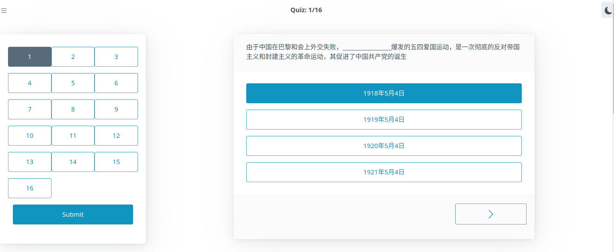
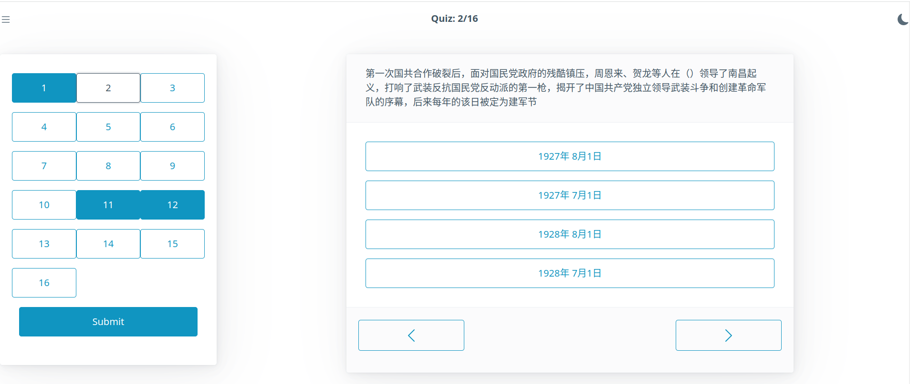
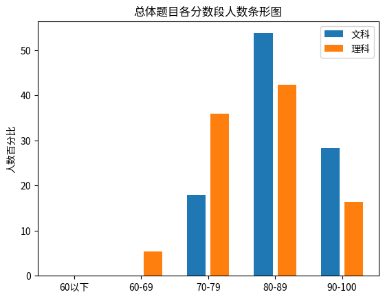
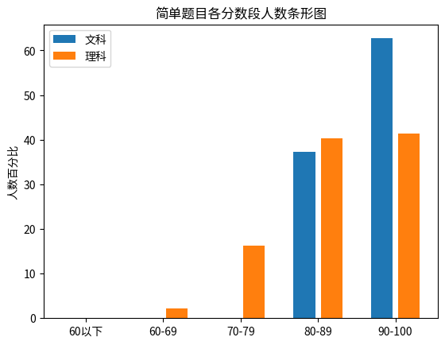
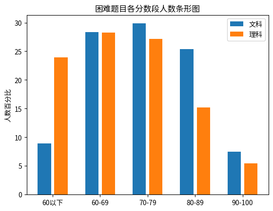
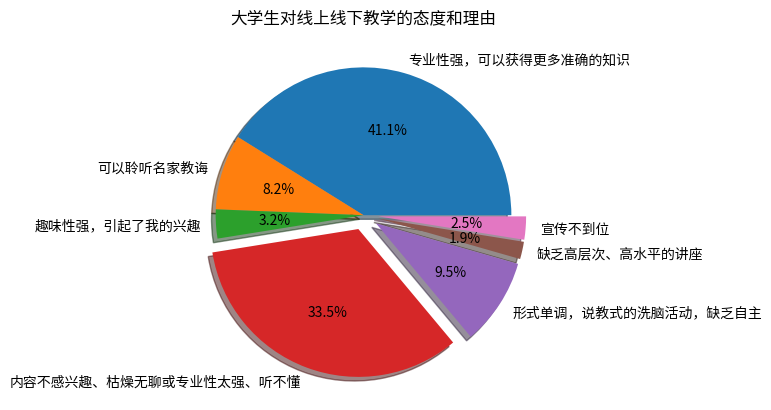
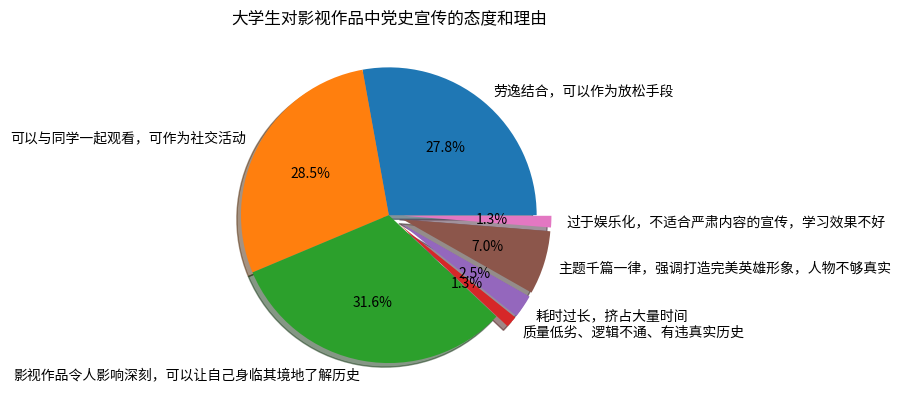
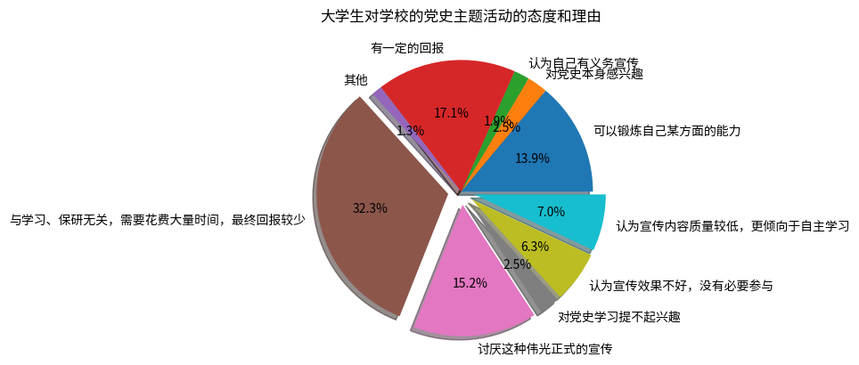
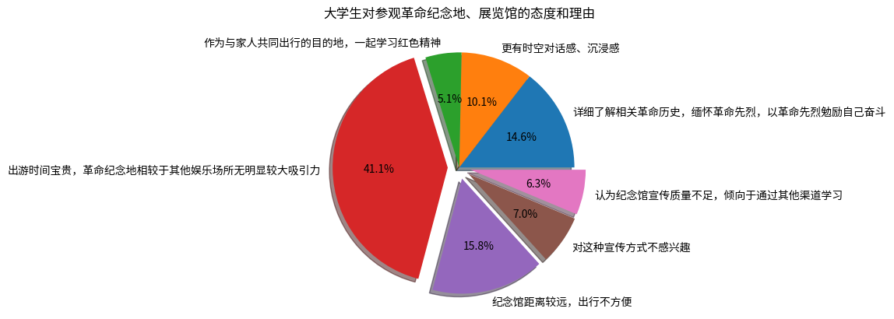
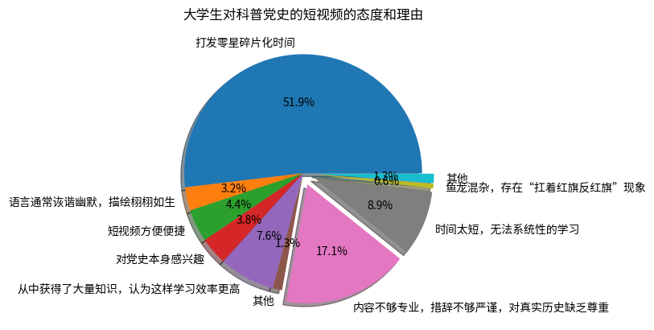

# 社会实践报告

## 一、选题内容与意义

### 1.1 选题内容

#### hcy todo

### 1.2 选题意义

#### hcy todo

## 二、背景调研

### 2.1 调查方式

为了更好地对当代大学生的党史知识掌握情况进行调查，考虑到评估自身的掌握情况会因为包括主观认知等诸多原因导致信息失真，我们采用了客观题测试和普通调查问卷两种方式相结合的调研方法，在实践中取得了很好的效果。

#### 2.1.1 客观题测试设计

为保证客观题的权威性和表述的严谨性，我们认为仅靠自己命题是不合适的；与之相对的，我们选择了以包括历年各地区高考真题、考研真题中党史相关的题目为基础，构建了一个包含235道选择题的题库；每次测试时，我们设计的程序会自动从中随机抽取13道完全不同的测试用题目和3道检查用题目组成16道选择题，在随机排序并随机打乱选项顺序后显示在网页上来进行测试，以此来确保测试用的题目是权威且可靠的。

在题库的建设中，我们发现存在不少题目是高度相似的，因此我们在题库内引入了“相似题目”的概念：当题A和题B均和题C为相似题目，或者我们讨论后认为这两道题目是相似的，那么这两道题目就是“相似题目”；这样的题目出现在同一个问卷中，可能会导致熟悉这部分党史的受试者得到相对于其真实了解情况较高的分数，以及不了解这部分党史的受试者得到相对于其真实了解情况较低的分数，因此在生成问卷时，程序会自动实现13道随机抽取的测试用题目互相不是“相似题目”。借助于我们所处的计算机专业所学得的相关知识，我们可以让生成测试题目的程序以高效率运行的同时，回避两两检查所有题目是否相似这一过于繁重的任务，而只需要检查有限组题目是否相似。此外，考虑到题目难度不尽相同，我们在题库中同时对题目进行了简单的分类，分为偏基础的题目和较为深入的题目，并按照8道偏基础的题目配合5道偏深入的题目来准备13道测试用题目。

为了更进一步体现真实结果，避免受试者通过其他渠道得到问题的答案，我们在后台记录了受试者的是否离开当前页面以及离开的时长：在通常情况下，受试者应当一直在同一个网页完成测试才会离开，因此长期或频繁离开测试页面是不合理的，通常受试者是在尝试通过搜索引擎得到答案。在实践中，我们设置的要求是离开页面小于等于4次，且在看到超过5道题的内容后，离开页面的总时长不超过3分钟，且完成测试的总时长不超过16分钟，测试的结果才会被视为有效。在测试结束后，受试者并不会知道测试用题目的答案，以及他的结果是否被纳入统计中，我们认为这样可以在最大限度保障后续测试真实性的同时，避免测试本身有过强的说教意味和历史考试氛围。

此外，考虑到可能存在随意乱选，只是把所有题目都填上一个选项而不看题目的受试者，我们额外加入了3道检查用题目。3道检查用题目分别和之前的13道测试用题目中的3道为“相似题目”，且重新调整了选项的顺序。若受试者为认真完成，则检查用题目的答案应当和对应的测试用题目答案一致但选项不同，且即使发生错误也应当是相同的错误，反之则说明受试者有可能并没有认真完成。在实践中，考虑到可能存在手误等若干意外因素，我们控制检查用题目一定是和偏基础的题目为“相似题目”，并设置不匹配上限为2，即超过2道（含2道）检查用题目和之前的测试用题目不匹配的测试数据会被判定为无效，进而被舍弃。为抑制测试的说教意味，因为这个原因导致测试数据被舍弃同样不会告知受试者本人。

在之后的分析中，我们只考虑了测试用题目回答的准确性，并没有考虑检查用题目的回答情况，因为后者与前者存在重复。通过以上种种设计，我们得到了较为准确客观的当代大学生对党史的掌握情况。

按照上述方法，我们设计并搭建了符合我们需求的网站，答题界面如下图所示：

#### 2.1.2 调查问卷设计

考虑到党史宣传的效果的评估还包括了受宣传者的主观感受，完全依靠客观题的评估是不合适的，因此我们依然保留了传统调查问卷的调查方法。在设计时，为了令调查问卷兼具简洁和深入，我们参考、学习了大量已有的调查问卷的设计，并在此基础上结合自身生活实践设计了自己的调查问卷。在实践中调查问卷被附在客观题测试的后面，在完成客观题之后再在网页上显示。借助于之前客观题测试的结果，我们得以快速找出不可靠的调查问卷结果，从而避免污染数据，维护调查问卷结果的可靠性。由于大部分客观的内容已经被之前的客观题测试完成，因此调查问卷集中于接受党史宣传的方式、宣传的感受以及对未来的期望，以此来从另一个角度评估党史宣传的结果。

### 2.2 调查结果

#### 2.2.1 当代大学生对基础党史知识的掌握情况

我们合计收到了159份有效的客观题测试结果，其中包括67份来自文科学生的测试结果以及92份来自理工科学生的测试结果，整体数据如下图所示：

可以发现，文科学生的成绩略优于理工科学生，但总体而言则显得良莠不齐，并不能说是很好——这与我们预想的结果不符。进一步深入研究，对于不同难度的题目分别进行统计，发现：

对于偏基础的题目：

尽管文科学生略优于理工科学生，但二者总体水平都非常好。进一步研究题库中偏基础的题目，发现这部分党史内容集中于教科书上有硬性规定、要考试的部分，绝大多数学生对这一部分内容的掌握都非常优秀，甚至超出了我们的预期，这是值得肯定的。

而对于偏深入的内容：

文科学生依然略优于理工科学生，但二者结果都不容乐观。这一部分对应的党史内容往往不是考试的硬性要求，更多的依靠学生自发地进行学习，而学习的效果不容乐观。而在本次调查之外的组内同学个人调查中，我们发现，因为考点的变化，导致对同样的党史内容，不同年级学生的掌握水平出现了巨大的差异。

对教科书内容及有硬性要求的党史掌握的很好，但拘泥于教科书内容，缺少对党史学习的兴趣，缺乏主动深入学习党史，这是我们通过客观题测试得出的当代大学生对于党史学习的现状。

#### 2.2.2 当代大学生对党史宣传不同途径的态度

基于一些前期工作，我们认为大学生学习党史的途径主要包括线上线下教学、影视作品、党史主题活动、参观革命纪念地、通过视频及短视频学习这些方面。随后的调查问卷证实了我们的先期工作，并且通过对调查问卷的整理，我们得到了更为详细的数据。

##### 2.2.2.1 线上线下教学的宣传效果

大部分学生都对通过线上线下教学的党史学习持积极态度，但也有相当一部分同学不认为这种方式非常好。由饼状图不难看出，无论是持积极态度还是持消极态度，其主要原因都是专业性较强，对党史有详细、严谨、完善的表述，这和我们预想的相符。我们认为通过线上线下教学来进行的党史宣传是重要且有效的，但教学时间有限，更多要依靠课堂之外的时间来进行自学。

##### 2.2.2.2 影视作品的宣传效果

大部分大学生都认为影视作品的宣传效果很好，并且喜欢的理由主要是因为影视作品的表现形式。应当指出，依然有部分大学生认为的影视作品中人物形象过于“高大全”“伟光正”，并不够接地气；不合适的影视作品可能会导致反效果。

##### 2.2.2.3 党史主题活动的宣传效果

不少大学生都对这种宣传方式持负面看法，认为这在耗费时间的同时缺乏效果和实际意义，这一方面反映出对党史学习兴趣的缺乏是普遍存在的，另一方面也反映出不少党史主题活动其党史宣传其实并不到位，宣传工作很难说做的很好。

##### 2.2.2.4 革命纪念地的宣传效果

这一部分大部分大学生依然持负面观点，但值得注意的是，大部分曾参观过的革命纪念地、革命博物馆的大学生都认为这是一种非常好的党史宣传方式，且其持正面评价的原因多集中于能够更深入的了解党史本身而非其他目的，而持负面评价的大学生多为听到名字就避而远之或缺乏行动动机，这引起了我们作进一步调查的兴趣。在综合诸因素考量后，我们选择考察中共代表团梅园新村纪念馆这一重要爱国主义教育基地，以亲身体验的方式来进一步研究其宣传效果。

##### 2.2.2.5 视频及短视频的宣传效果

大部分大学生都对通过视频及短视频宣传党史并不反感，但绝大多数都只是将其作为处理零星碎片时间的手段，而鲜有为了学习党史而认真看视频的。特别地，我们在调查结果中，看到有人提到视频及短视频平台存在“扛着红旗反红旗”的现象；而在进一步调查中，我们发现确实存在通过将虚假内容嫁接于真实内容至上以博取眼球，乃至刻意弱化、解构红色精神内核，将为共产主义事业而奋斗的崇高精神曲解为简单的儿女情长等一系列极具误导性的错误内容，且屡禁不止。考虑到视频及短视频作者鱼龙混杂，水平参差不齐，且很多人是以盈利的目的来创作内容，因此我们不认为这是一个可靠的党史宣传方法。

## 三、实践内容

### 见第二组

## 四、总结与展望

#### hcy todo

## 附录

### 1. 题库试题样例

见群里**问卷定稿**

### 2. 调查问卷样例

见群里**问卷定稿**

### 3. 调查结果原始数据

| 分数段 | 60以下 | 60-69 | 70-79 | 80-89 | 90-100 | 总计 |
| :----- | :----- | :---- | :---- | :---- | :----- | :--- |
| 文科 | 0 | 1 | 9 | 26 | 30 | 66 |
| 理科 | 2 | 10 | 22 | 24 | 34 | 92 |
| 总计 | 2 | 11 | 31 | 50 | 64 | 158 |

表 1：基础党史知识问答结果

| 对党史学习兴趣程度 | 非常感兴趣 | 感兴趣 | 一般 | 不感兴趣 | 非常不感兴趣 | 总计 |
| :----------------- | :--------- | :----- | :--- | :------- | :------------- | :--- |
| 人数               | 0          | 0      | 0    | 0        | 0              | 0    |

表 2：党史学习兴趣程度调查结果

| 党史学习的感兴趣途径 （可多选） | 人数 |
| :----------- | :--- |
| 线上线下教学（政治课、党课培训、青年大学习等）|83|
| 电影电视等影视作品（《长津湖》，《那年那兔那些事儿》等）|139|
| 党史主题活动（宣传橱窗、论坛、演讲等）|58|
| 参观革命纪念地、展览馆等 |47|
| 短视频平台（如 B站、抖音等）科普 |114|

表 3: 党史学习途径调查结果

| 对线上线下教学感兴趣/不感兴趣的理由 | 人数 | 人数百分比 |
| :----------------------------- | :--- | :--------- |
| 专业性强，可以获得更多准确的知识 | 65 | 41.14% |
| 可以聆听名家教诲 | 13 | 8.23% |
| 趣味性强，引起了我的兴趣 | 5 | 3.16% |
| 感兴趣人数总计 | 83 | 52.53% |
| 内容不感兴趣、枯燥无聊或专业性太强、听不懂 | 53 | 33.54% |
| 形式单调，说教式的洗脑活动，缺乏自主 | 15 | 9.49% |
| 缺乏高层次、高水平的讲座 | 3 | 1.90% |
| 宣传不到位 | 4 | 2.53% |
| 不感兴趣人数总计 | 75 | 47.47% |
| 总计 | 158 | 100.00% |

表 4: 对党史线上线下教学的态度及原因

| 对影视作品中党史宣传感兴趣/不感兴趣的理由 | 人数 | 人数百分比 |
| :----------------------------- | :--- | :--------- |
| 劳逸结合，可以作为放松手段 | 44 | 27.85% |
| 可以与同学一起观看，可作为社交活动 | 45 | 28.48% |
| 影视作品令人影响深刻，可以让自己身临其境地了解历史 | 50 | 31.65% |
| 感兴趣人数总计 | 139 | 87.97% |
| 质量低劣、逻辑不通、有违真实历史 | 2 | 1.27% |
| 耗时过长，挤占大量时间 | 4 | 2.53% |
| 主题千篇一律，强调打造完美英雄形象，人物不够真实 | 11 | 6.96% |
| 过于娱乐化，不适合严肃内容的宣传，学习效果不好 | 2 | 1.27% |
| 不感兴趣人数总计 | 19 | 12.03% |
| 总计 | 158 | 100.00% |

表 5: 对影视作品中党史宣传的态度及原因

| 对学校的党史主题活动感兴趣/不感兴趣的理由 | 人数 | 人数百分比 |
| :----------------------------- | :--- | :--------- |
| 可以锻炼自己某方面的能力 | 22 | 13.92% |
| 对党史本身感兴趣 | 4 | 2.53% |
| 认为自己有义务宣传 | 3 | 1.90% |
| 有一定的回报 | 27 | 17.09% |
| 其他 | 2 | 1.27% |
| 感兴趣人数总计 | 58 | 36.71% |
| 与学习、保研无关，需要花费大量时间，最终回报较少 | 51 | 32.28% |
| 讨厌这种伟光正式的宣传 | 24 | 15.19% |
| 对党史学习提不起兴趣 | 4 | 2.53% |
| 认为宣传效果不好，没有必要参与 | 10 | 6.33% |
| 认为宣传内容质量较低，更倾向于自主学习 | 11 | 6.96% |
| 不感兴趣人数总计 | 100 | 63.29% |
| 总计 | 158 | 100.00% |

表 6: 对学校的党史主题活动的态度及原因

| 对参观革命纪念地、展览馆感兴趣/不感兴趣的理由 | 人数 | 人数百分比 |
| :----------------------------- | :--- | :--------- |
| 详细了解相关革命历史，缅怀革命先烈，以革命先烈勉励自己奋斗 | 23 | 14.56% |
| 更有时空对话感、沉浸感 | 16 | 10.13% |
| 作为与家人共同出行的目的地，一起学习红色精神 | 8 | 5.06% |
| 感兴趣人数总计 | 47 | 29.75% |
| 出游时间宝贵，革命纪念地相较于其他娱乐场所无明显较大吸引力 | 65 | 41.14% |
| 纪念馆距离较远，出行不方便 | 25 | 15.82% |
| 对这种宣传方式不感兴趣 | 11 | 6.96% |
| 认为纪念馆宣传质量不足，倾向于通过其他渠道学习 | 10 | 6.33% |
| 不感兴趣人数总计 | 111 | 70.25% |
| 总计 | 158 | 100.00% |

表 7: 对参观革命纪念地、展览馆的态度及原因

| 对科普党史的短视频感兴趣/不感兴趣的理由 | 人数 | 人数百分比 |
| :----------------------------- | :--- | :--------- |
| 打发零星碎片化时间 | 82 | 51.90% |
| 语言通常诙谐幽默，描绘栩栩如生 | 5 | 3.16% |
| 短视频方便便捷 | 7 | 4.43% |
| 对党史本身感兴趣 | 6 | 3.80% |
| 从中获得了大量知识，认为这样学习效率更高 | 12 | 7.59% |
| 其他 | 2 | 1.27% |
| 感兴趣人数总计 | 114 | 72.15% |
| 内容不够专业，措辞不够严谨，对真实历史缺乏尊重 | 27 | 17.09% |
| 时间太短，无法系统性的学习 | 14 | 8.86% |
| 鱼龙混杂，存在“扛着红旗反红旗”现象 | 1 | 0.63% |
| 其他 | 2 | 1.27% |
| 不感兴趣人数总计 | 44 | 27.85% |
| 总计 | 158 | 100.00% |

表 8: 对科普党史的短视频的态度及原因

| 您认为党史宣传做到哪些方面更能吸引到您？| 人数 | 占比 |
| :--- | :--- | :--- |
| 内容专业性强，尊重历史 | 34 | 21.52% |
| 内容诙谐幽默，栩栩如生 | 68 | 43.04% |
| 强调学生自发性探索 | 7 | 4.43% |
| 视听多要素结合 | 49 | 31.01% |
| 总计 | 158 | 100.00% |

表 9: 对党史宣传期望的侧重方面

### 4. 梅园新村学习成果检测及结果

见群里**梅园新村试题**，和数据。

## 参考文献

[1]赵霞. 大学生党员党史、国史教育研究[D].天津师范大学,2014.

[2]黄新辉,袁媛,汤妮.提升大学生党史教育实效性的路径探析[J].高校后勤研究,2022,No.248(11):35-37.

[3]万燕.接受理论视域下大学生党史教育的逻辑、困境和对策[J].林区教学,2022,No.308(11):14-18.

[4]杜雅静.高校大学生党史教育的意义及实现路径[J].湖北开放职业学院学报,2022,35(14):130-131.
